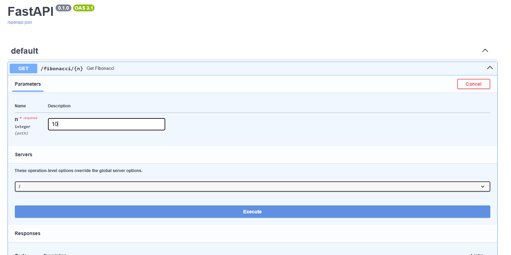
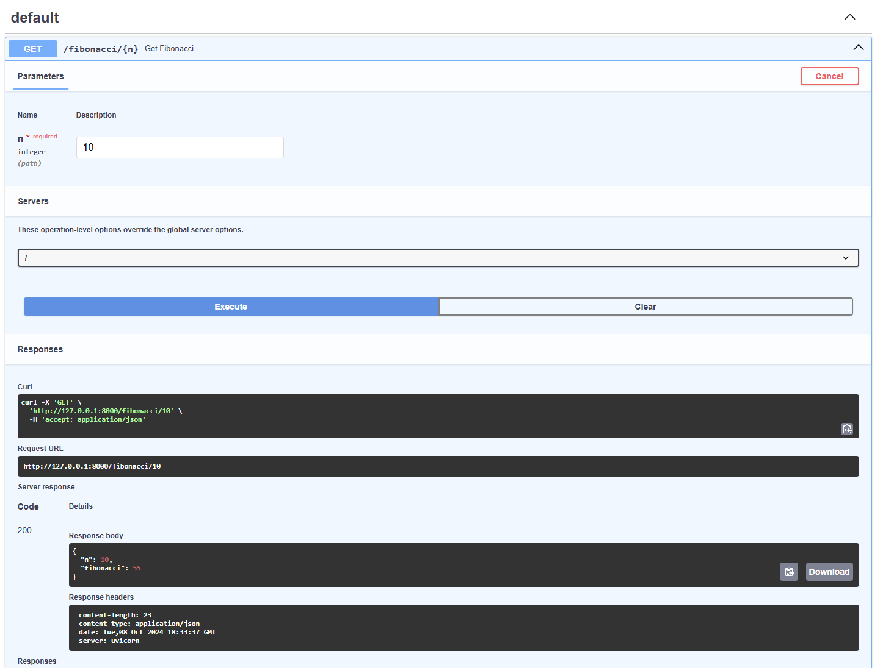

# Fibonacci Sequence API

## Overview
This API is a REST API that processes and return the Nth number in the Fibonacci sequence. This is built using Python and FastAPI.

## The Fibonacci Sequence
The Fibonacci sequence is a series of numbers where each number is the sum of the two preceding ones. It typically starts with 0 and 1. The sequence goes as follows:

0, 1, 1, 2, 3, 5, 8, 13, 21, 34, ...

Mathematically, it's defined as:
```
F(n) = F(n-1) + F(n-2)
Where:
F(0) = 0 and F(1) = 1
```

For example, to calculate the 5th Fibonacci number:
```
F(5) = F(4) + F(3) = 3 + 2 = 5
```

## Project Setup
1. Clone the repo
```
git clone https://github.com/your-username/FibonacciAPI.git
cd FibonacciAPI
```

2. Create the virtual Environment
```
python -m venv venv
source venv/scripts/activate  # On Windows, use `venv\Scripts\activate`
```

3. Install dependencies
```
pip install -r requirements.txt
```

## Running the API
```
uvicorn app:app --reload
```
If everything is working properly the server should start at 
```
http://127.0.0.1:8000
```

# Testing the API
## Swagger
To access the Swagger UI go to
```
http://127.0.0.1:8000/docs
```
For the GET section make sure you input the number you want to calculate. For intance in the screen shot below we are using 10 in the paramaters field. To send the request press the 'Execute' button.



This will show the result of the API request as seen below. After sending the GET request with the number 10 we can see the Fibonacci response is 55 as shown below.



## Curl
We can use curl to send a GET reauest to the API. To send a GET request you can try this:
```
curl -X GET "http://127.0.0.1:8000/fibonacci/10"
```

The response will look like this:
```
{"n":10,"fibonacci":55}
```